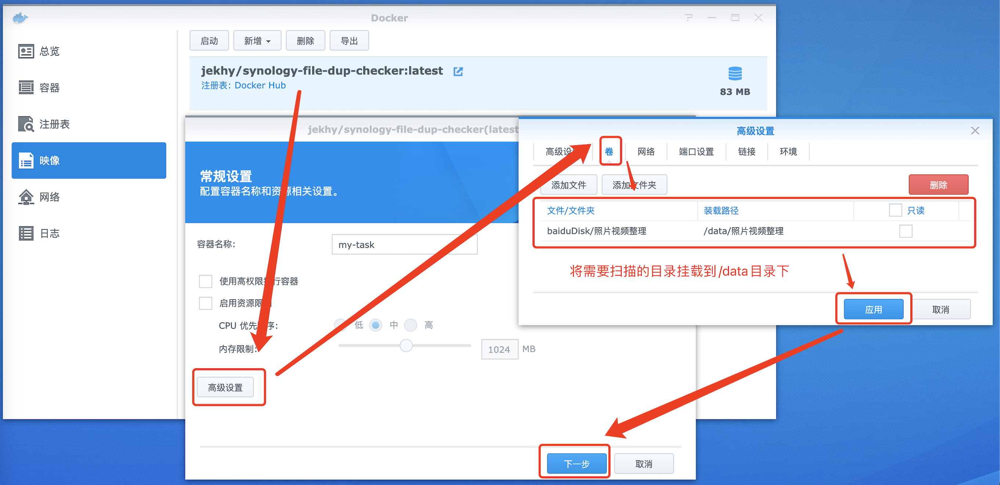
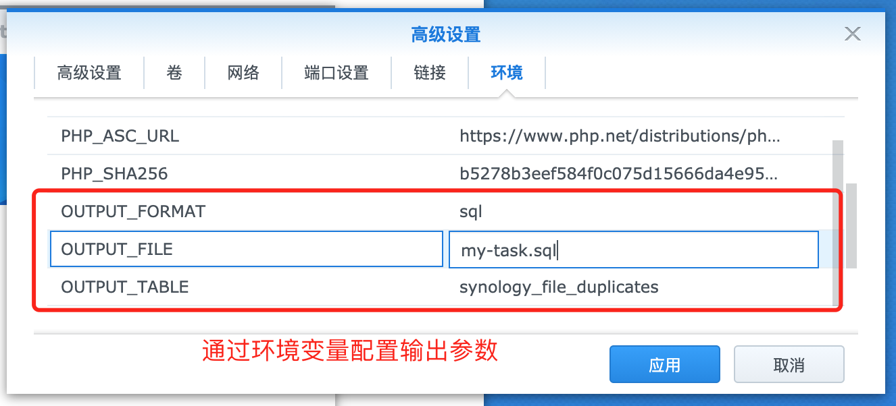

## 使用方法 | Usage

Example:

### 命令行模式
```shell
docker run --rm \
    -v YOUR_PATH1:/data/YOUR_PATH1 \
    -v YOUR_PATH2:/data/YOUR_PATH2 \
    -v $(pwd)/:/output \
    -e OUTPUT_FILE=result.csv \
    -e OUTPUT_FORMAT=csv \
    jekhy/synology-file-dup-checker
```

### GUI模式



