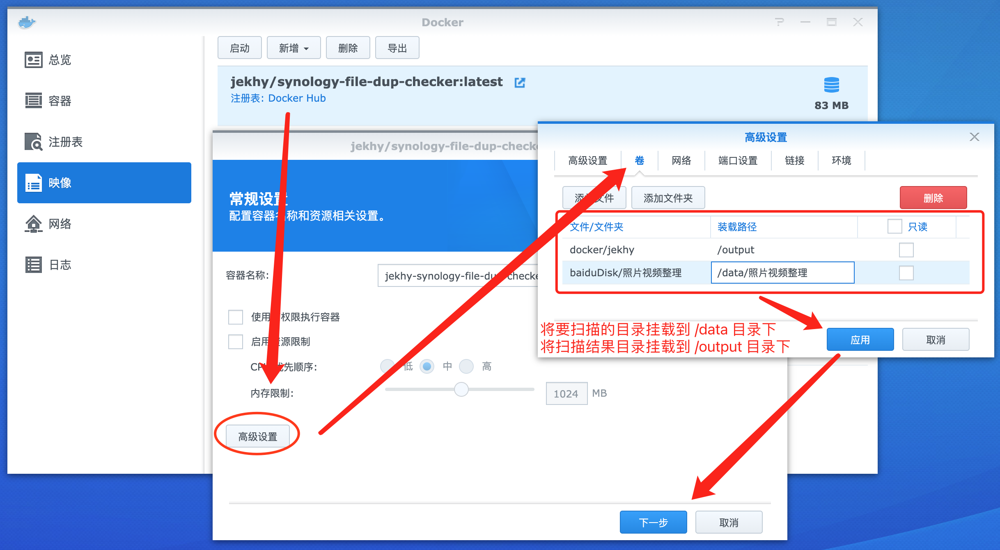

## 使用方法 | Usage

### 命令行模式
```shell
docker run --rm \
    -v YOUR_PATH1:/data/YOUR_PATH1 \
    -v YOUR_PATH2:/data/YOUR_PATH2 \
    -v $(pwd)/:/output \
    -e OUTPUT_FILE=result.csv \
    -e OUTPUT_FORMAT=csv \
    jekhy/synology-file-dup-checker
```

### GUI模式



容器启动后会递归遍历`/data`目录下的所有文件，
最终输出结果将保存到`/output`目录下。


## 环境变量中可配置参数
* OUTPUT_FILE : 输出文件名，为空时会自动按日期时间生成
* OUTPUT_FORMAT : 输出格式，支持sql、csv、json，默认json
* OUTPUT_TABLE : 输出数据表名，当OUTPUT_FORMAT为sql时生效，默认synology_file_duplicates
